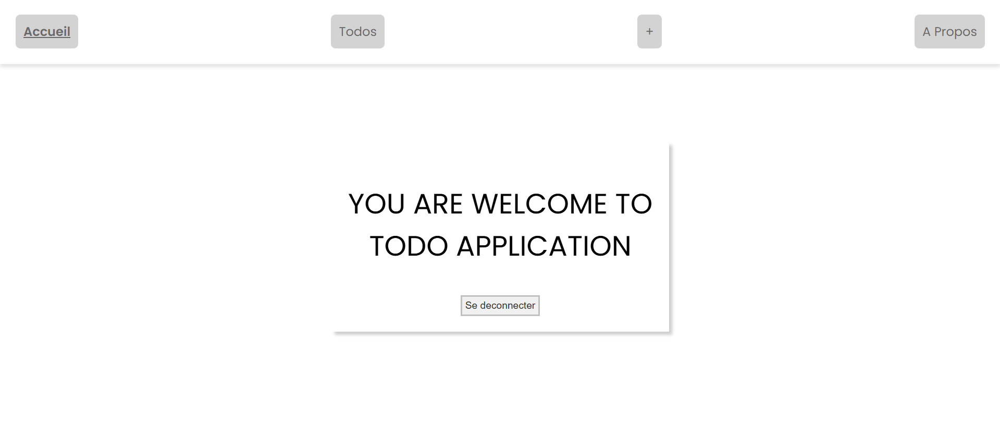

# Todolist
This project was made with Angular version 18.2.11.

## Development server

Run `ng serve` for a dev server. Navigate to `http://localhost:4200/`. The application will automatically reload if you change any of the source files.

## Backend Server
The backend server is one the repository :
https://github.com/Harlequelrah/fastapi_todolist
## Build

Run `ng build` to build the project. The build artifacts will be stored in the `dist/` directory.

## ScreenShots
### `LandingPage`

### `AboutPage`

### `TodosPage`

### `LoginPage`

### `TodoPage`

### `RegistrationPage`

### `NewTodoPage`

## Further help

To get more help on the Angular CLI use `ng help` or go check out the [Angular CLI Overview and Command Reference](https://angular.dev/tools/cli) page.

## Contact US

Email : maximeatsoudegbovi@gmail.com
